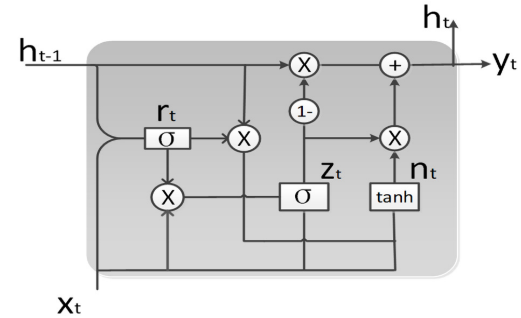

# Bitcoin Prediction Website

Website to predict Bitcoin Price, built for last assignment as Informatic student at UPNYK with Flask and Tensorflow libs.

## Neural Network Architecture

Implement [Optimized Gated Recurrent Unit](https://www.researchgate.net/publication/337083179_OGRU_An_Optimized_Gated_Recurrent_Unit_Neural_Network) (Wang et al., 2019) to built the prediction model and used Adaptive Moment Estimation (ADAM) as optimation.

# Optimation Illustration

[Adaptive Moment Estimation](https://arxiv.org/abs/1412.6980) (ADAM) use gradient to optimizing the next hyper parameter in neural network (Kingma & Lei Ba, 2015).

Website Template Name: [MyResume](https://bootstrapmade.com/free-html-bootstrap-template-my-resume/)
Author & Licences of Website Template: [BootstrapMade.com](https://bootstrapmade.com/license/)
